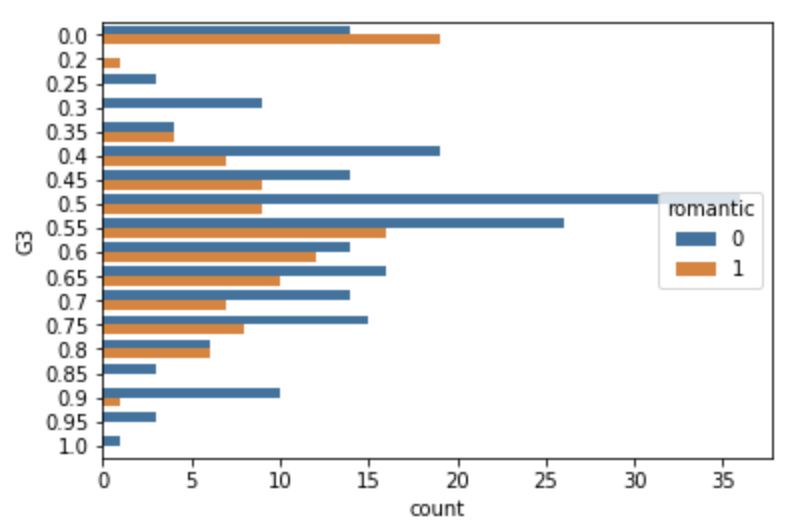
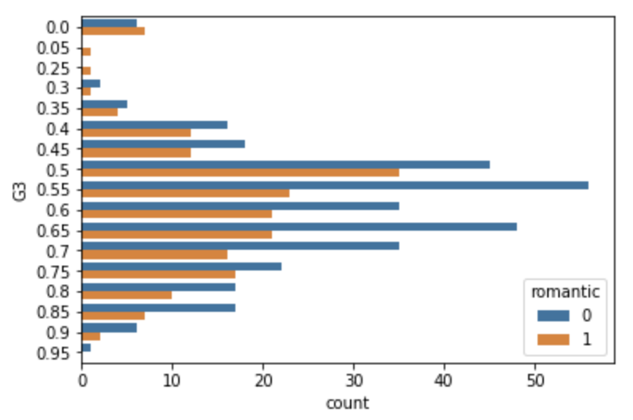
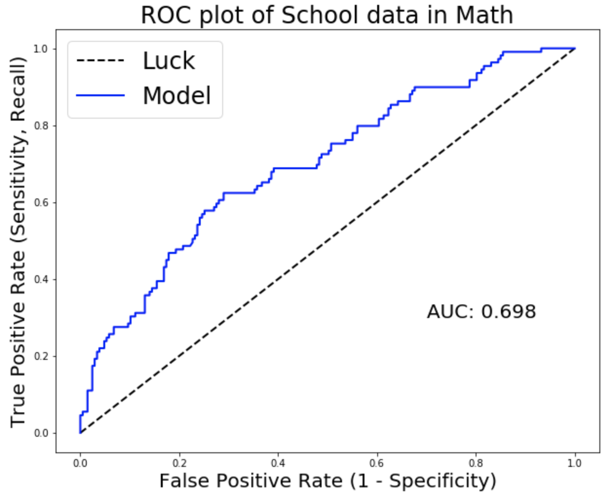
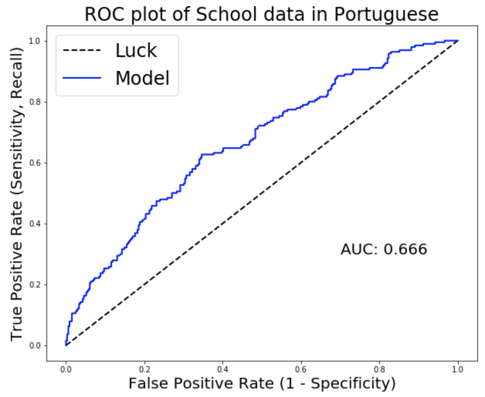
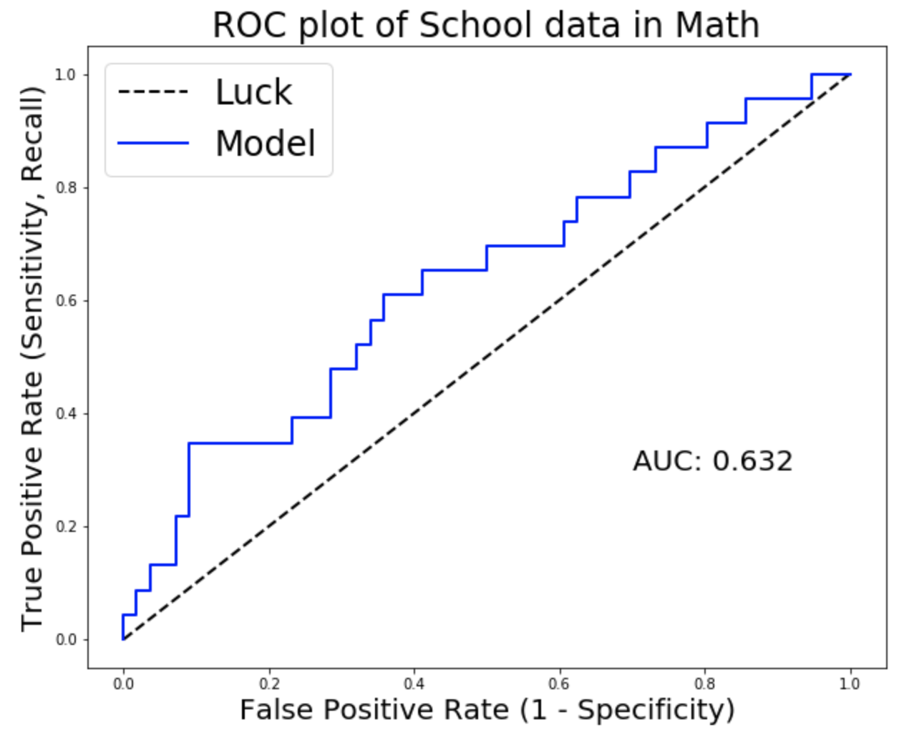
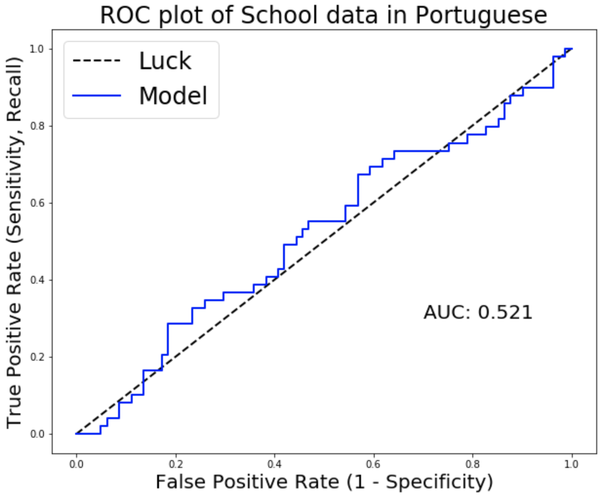
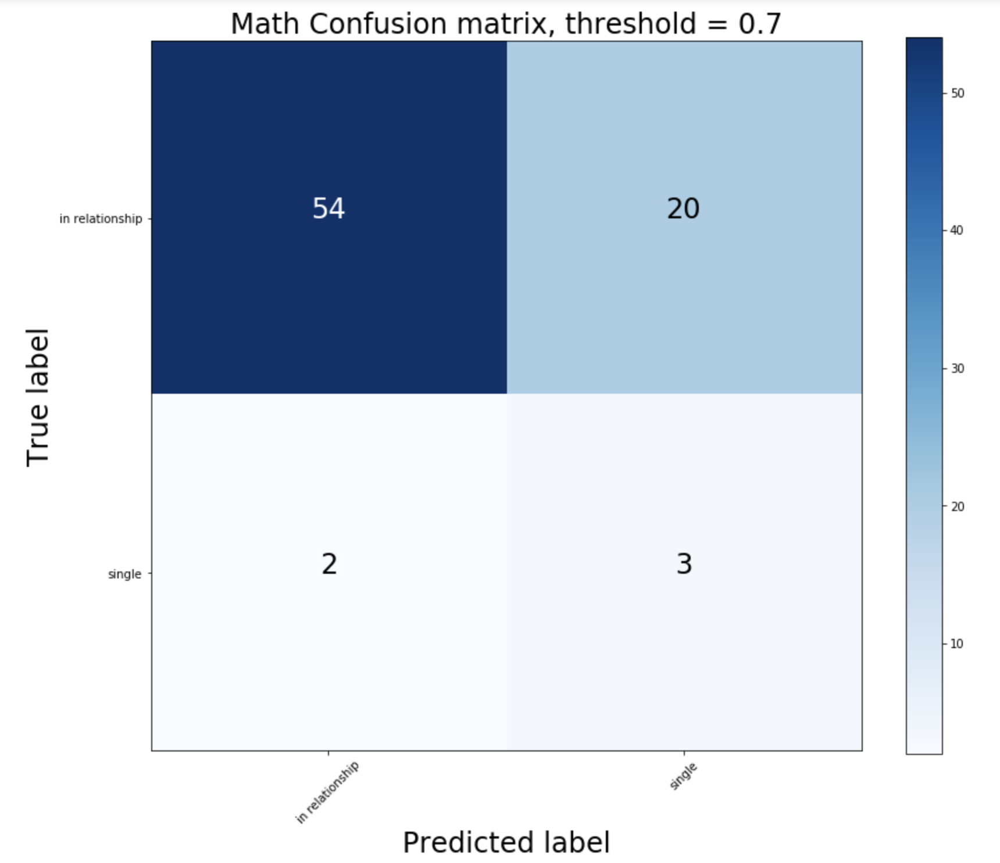
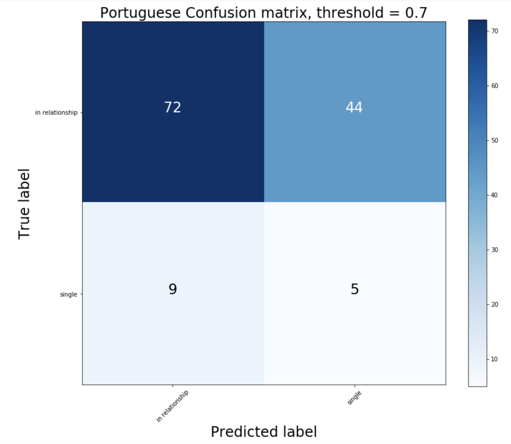

**********************************************
# Does "Work-Life Balance" Matter?

## Predicting Relationship Status Using Student Educational Data
**********************************************

#### Author: Taite Sandefer
#### Website: https://github.com/tsandefer/capstone_1
***

# Background

As a manager, it might be important to consider how your expectations of employees might impact their ability to maintain a healthy work-life balance, since worker productivity could depend on the degree to which basic needs have been met. 

To borrow from Aristotle, "man is by nature a social animal."

So, it seems that social connection might qualify as a basic human need that impacts productivity.

But how do we help each other find the right level of social connection, so that we can thrive in that sweet spot between distraction and isolation?

Aristotle also claims that "society precedes the individual," and that "anyone who either cannot lead the common life or is so self-sufficient as not to need to, and therefore does not partake of society, is either a beast or a god."

This two-tailed postulate suggests that people who are not actively social will tend to be on the extremes when it comes to performance. In general, is this true? When people develop close relationships with others, is their overall productivity inherently different from those who aren't as connected to others?

# Question

For now, it might be useful to look at smaller-scale relationships between productivity and social connection. While we might not be able to collect data on all humans that precisely measures productivity and social activity, there is available data on social, demographic, and educational features that we might be able to leverage so that we might have a better understanding of this relationship.

Can we predict a student's relationship status based on their academic performance and outcomes?

## MVP
1. Encode features so that data can be analyzed via logistic regression
2. Leverage Cross Validation to aid in model/feature selection
3. Using the CV selected model, conduct logistic regression analysis to explore how well the 'best' model can predict relationship status using educational outcomes/characteristics

# The Data: EDA

### High School Students in Portugal

The University of Minho's Paulo Cortez and Alice Silva collected data regarding student grades, demographics, social and school related features on high school students during the 2005-6 school year in Portugal for the purpose of using data mining techniques to predict secondary school performance (http://www3.dsi.uminho.pt/pcortez/student.pdf).

Some of the data was obtained from school records, while information for other features was gathered through questionnaires conducted by Cortez and Silva.

# EDA

## Groups

* 395 students in Math courses
* 649 students in Portuguese courses

For both groups, the odds of being in a relationship were roughly 1:2

## Feature Categories

* Demographic Characteristics:
       
       school, sex, age, address, traveltime, internet, health

* Social Connection:
      
      famsize, Pstatus, Medu, Fedu, Mjob, Fjob, reason, guardian, schoolsup, famsup, paid, nursery, famrel, goout, Dacl, Walc

* Eductional Performance and Outcomes:
      
      studytime, failures, activities, higher, freetime, romantic, G1, G2, G3, absences

## Math Students: Final Grade Distributions by Relationship Status

## Portuguese Students: Final Grade Distributions by Relationship Status

# Approach

### Regression

Using SKLearn's LogisticRegression, since we are using our data to predict the probability of a binary variable being positive.

## Cross Validation:

Using StratifiedKFold because it preserves the percentage of samples from each class.

Evaluating the performance of 3 models with varying features:

    1. Full model uses all 69 predictors
    2. Secondary model uses 29 predictors, using demographic and educational performance features
    3. Third model uses 18 predictors, focusing on outcomes only

### Model Specs

In logistic regression, it's important to specify:

    class_weight = 'balanced'
    
since the odds are 1:2 for being in the relationship class

## Model Evaluation

### CV & Performance Metrics

Since the hypothesis that students who are in a relationship simply perform differently than those who are not in a relationship is two-tailed in nature, we'd likely prefer to improve our overall model's accuracy, rather than focusing on reducing false positives or false negatives specifically.

However, based on the assumption that students who are in a relationship are generally more "rare" (with odds of 1:2) than those who are not in a relationship, we might improve our accuracy by tending to predict a student is not in a relationship in the face of uncertainty.

It seems that we would prefer to minimize the false positive rate (FPR), as we would likely make more "correct" predictions if we tended to predict/guess that a student is NOT in a relationship in situations when we are less certain (the predicted probability is closer to 0.5), just based on the intuitive likelihood that the proportion of single students in the population is fairly high.

Thus, we use a combination of accuracy and precision to determine which model performed best. 

For both Math and Portuguese students, the 3rd model that I tested performed the best, which contained only features on educational outcomes.

This best model used measures on the following features:
    
        ['absences', 'G3', 'activities', 'higher', 'studytime_2', 'studytime_3', 'studytime_4', 'failures_1', 'failures_2', 'failures_3', 'freetime_2', 'freetime_3', 'freetime_4', 'freetime_5', 'health_2', 'health_3', 'health_4', 'health_5']

Using a 0.5 predicted probability threshold, we obtained the following evaluation metrics with this model:

    Math Students: 57% accuracy, 42% precision
    Portuguese Students: 59% accuracy, 46% precision

However, once I increased my threshold for prediction from 0.5 to 0.7, I found even better model performance. 

    Math Students: 69% accuracy, 68% precision
    Portuguese Students: 65% accuracy, 60% precision
    
    
# Results & Analysis

## Best Model: ROC Curves on Training Data 

## Best Model: ROC Curves on Test Data 

## Math Confusion Matrix

## Portuguese Confusion Matrix

## Coefficients and Initial Interpretation

Focusing on students in Portuguese courses, the coefficients yielded from our best model were -0.558 for percentage points in the final grade and -0.657 for whether or not a student wanted to pursue higher education. This implies that higher grades do increase the odds that a student is in a relationship, and that a student's desire to pursue higher education increases these odds as well. 

### Math Student Coefficients from Holdout Data:
{'absences': 0.038, 'G3': -1.166, 'activities': 0.134, 'higher': -1.11, 'studytime_2': 0.974, 'studytime_3': 1.134, 'studytime_4': -0.213, 'failures_1': -0.182, 'failures_2': 1.231, 'failures_3': -0.198, 'freetime_2': 0.925, 'freetime_3': 0.361, 'freetime_4': 0.513, 'freetime_5': 1.094, 'health_2': -0.134, 'health_3': 0.234, 'health_4': -0.2, 'health_5': 0.122}

### Portuguese Student Coefficients from Holdout Data:
{'absences': 0.044, 'G3': -0.558, 'activities': 0.229, 'higher': -0.657, 'studytime_2': 0.63, 'studytime_3': 1.0, 'studytime_4': -0.62, 'failures_1': 0.606, 'failures_2': 0.131, 'failures_3': -0.087, 'freetime_2': 0.635, 'freetime_3': 0.253, 'freetime_4': 0.046, 'freetime_5': 0.663, 'health_2': -0.294, 'health_3': -0.215, 'health_4': -0.508, 'health_5': -0.002}

## Future Exploration / Research
1. Further explore the interpretation of coefficients and confidence intervals for interpretation 

2. Supplement Logistic Regression with AB testing

3. Explore predictive abilities of educational characteristics & outcomes on other social connection statuses, such as "Pstatus," which reflects whether or not the student's parents are living in the same household

4. Take IV/Proxy variable into account so we can generalize the information we've gathered from this evidence regarding these Portuguese high school students' social connectivity and educational outcomes towards larger populations, such as all high school students, or all humans working towards a task.

## Citation
P. Cortez and A. Silva. Using Data Mining to Predict Secondary School Student Performance. In A. Brito and J. Teixeira Eds., Proceedings of 5th FUture BUsiness TEChnology Conference (FUBUTEC 2008) pp. 5-12, Porto, Portugal, April, 2008, EUROSIS, ISBN 978-9077381-39-7.
