# Does Work-Life Balance Matter?

  

## Using Student Educational Data to Predict Relationship Status

*Capstone I Project for Galvanize Data Science Immersive, Week 4*

*by Taite Sandefer*

*Last Updated: 4/4/19*

## Table of Contents
- [Introduction](#introduction)
  - [Background](#background)
  - [The Data](#the-data)
  - [Question & Hypothesis](#question-&-hypothesis)
  - [Methodology](#methodology)
- [Exploratory Data Analysis](#exploratory-data-analysis)
- [Model Selection](#model-selection)
  - [Test Metric: F1 Score](#test-metric-f1-score)
  - [Feature Selection](#feature-selection)
  - [Hyperparameter Tuning](#hyperparameter-tuning)
- [Chosen Model](#chosen-model)
  - [Specifications](#specifications)
  - [Model Assessment](#model-assessment)
  - [Results & Interpretation](#results-&-interpretation)
- [Conclusion](#model-selection)
- [Acknowledgements](#acknowledgements])

# Introduction

## Background

As a manager, it is important to consider how your expectations of employees could impact their ability to maintain a healthy work-life balance, since worker productivity is dependent on the degree to which basic needs have been met.

To borrow from Aristotle,
> "Man is by nature a social animal."

So, it seems that social connection might qualify as a basic human need that impacts productivity.

Aristotle also claims that
> "Society precedes the individual... Anyone who either cannot lead the common life or is so self-sufficient as not to need to, and therefore does not partake of society, is either a beast or a god."

But how do we help each other find the right level of social connection, so that we can thrive in that sweet spot between distraction and isolation?

This two-tailed postulate suggests that people who are not actively social will tend to be on the extremes when it comes to performance. In general, is this true? When people develop close relationships with others, is their overall productivity inherently different from those who aren't as connected to others?

## The Data

The University of Minho's Paulo Cortez and Alice Silva collected [this data](http://www3.dsi.uminho.pt/pcortez/student.pdf) regarding student grades, demographics, social and school related features on high school students during the 2005-6 school year in Portugal for the purpose of using data mining techniques to predict secondary school performance.

Some of the data was obtained from school records, while information for other features was gathered through questionnaires conducted by Cortez and Silva.

## Question & Hypothesis

For now, it would be useful to look at smaller-scale relationships between productivity and social connection. While we might not be able to collect data on all humans that precisely measures productivity and social activity, there is available data on social, demographic, and educational features that we might be able to leverage so that we might have a better understanding of this relationship.

Can we predict a student's relationship status based on their academic performance and outcomes?

MVP
1. Encode features so that data can be analyzed via logistic regression
2. Leverage Cross Validation to aid in model/feature selection
3. Using the CV selected model, conduct logistic regression analysis to explore how well the 'best' model can predict relationship status using educational outcomes/characteristics

## Methodology

  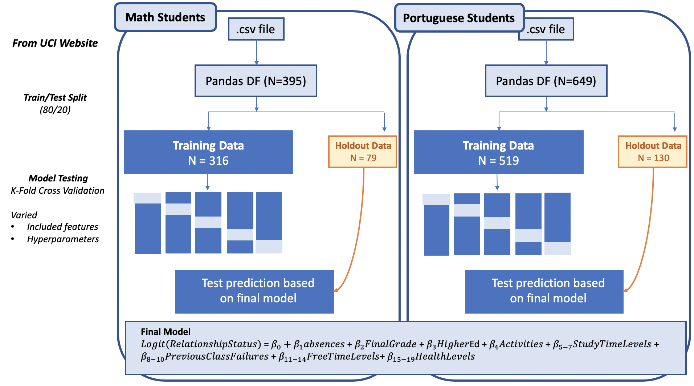

# Exploratory Data Analysis

### Groups

* 395 students in Math courses
* 649 students in Portuguese courses

For both groups, the odds of being in a relationship were roughly 1:2

### Feature Categories

* Demographic Characteristics:

       school, sex, age, address, traveltime, internet, health

* Social Connection:

      famsize, Pstatus, Medu, Fedu, Mjob, Fjob, reason, guardian, schoolsup, famsup, paid, nursery, famrel, goout, Dacl, Walc

* Eductional Performance and Outcomes:

      studytime, failures, activities, higher, freetime, romantic, G1, G2, G3, absences

  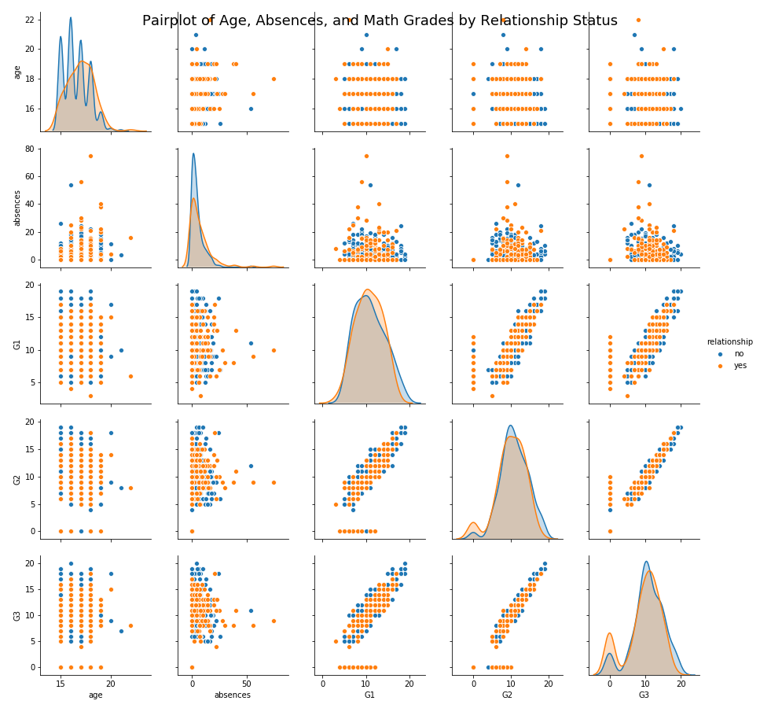
  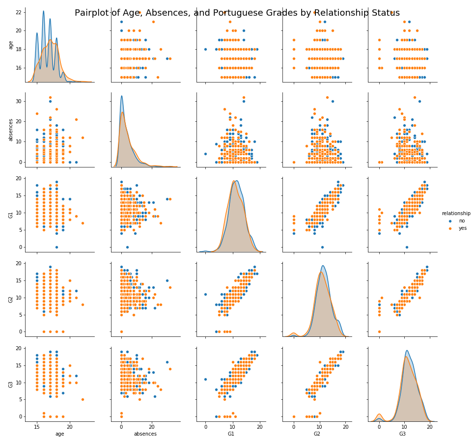

So, as we can see from both of these plots, the grade features (G1, G2, and G3) are strongly correlated. Since these variables each represent a given students' grade in the class at different periods throughout the year, it seems reasonable to simply use the final grade (G3) for the purposes of this analysis.

### Final Grade Distributions by Relationship Status

  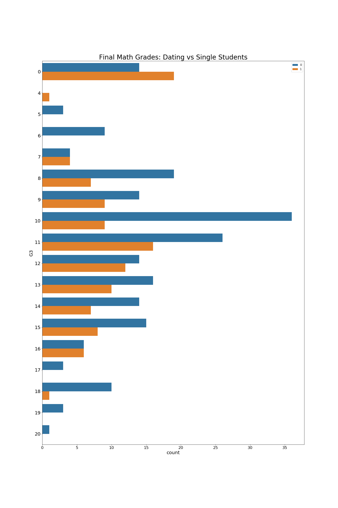
  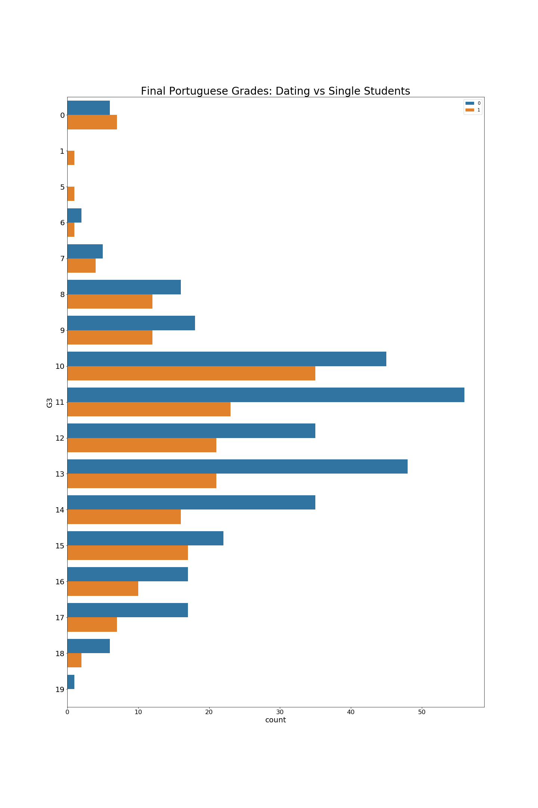

# Model Selection

### Logistic Regression

Using SKLearn's LogisticRegression, since we are using our data to predict the probability of a binary variable being positive.

**Cross Validation**

Using StratifiedKFold because it preserves the percentage of samples from each class.

## Test Metric: F1 Score
Since the hypothesis that students who are in a relationship simply perform differently than those who are not in a relationship is two-tailed in nature, it's equally desirable to reduce false positives and false negatives. 

Essentially, we want to pick up on the signal when it exists, and still be able to ignore false alarms. While accuracy might initially seem like a good metric to use, it can be deceiving in that proportionately high numbers of both false positives and false negatives can yield a seemingly "good" accuracy scores. 

Thus, we will use the F1 score for reflecting the model's ability to reduce both false positives and false negatives alike.

## Feature Selection
Evaluating the performance of 3 models with varying features:

    1. Full model uses all 69 predictors
    2. Secondary model uses 29 predictors, using demographic and educational performance features
    3. Third model uses 18 predictors, focusing on educational outcomes only

## Hyperparameter Tuning 
Used SKLearn's GridSearch to find the best values for the following hyperparameters.

| Hyperparameter | Math Dataset Optimal Value | Portuguese Dataset Optimal Value |
|---|---|---|
| penalty | 'l1' | 'l2' |
| C (inverse of regularization param) | 7.743 | 1.0 |

**Model Specs**

In logistic regression, it's important to specify:

    class_weight = 'balanced'

since the odds are 1:2 for being in the relationship class

# Chosen Model

## Specifications
    threshold=0.5
    class_weight = 'balanced'
    penalty = l1 (MATH), l2 (PORTUGUESE)
    C = 7.742636826811269 (MATH), 1.0 (PORTUGUESE)

For both Math and Portuguese students, the 3rd model that I tested performed the best, which contained only features on educational outcomes.

This best model used measures on the following features:

        ['absences', 'G3', 'activities', 'higher', 'studytime_2', 'studytime_3', 'studytime_4', 'failures_1', 'failures_2', 'failures_3', 'freetime_2', 'freetime_3', 'freetime_4', 'freetime_5', 'health_2', 'health_3', 'health_4', 'health_5']

## Model Assessment

### CV & Performance Metrics

Using a 0.5 predicted probability threshold, we obtained the following evaluation metrics with this model:

    Math Students: 46.1% F1 score
    Portuguese Students: 50.1% F1 score

### ROC Curves on Training Data

  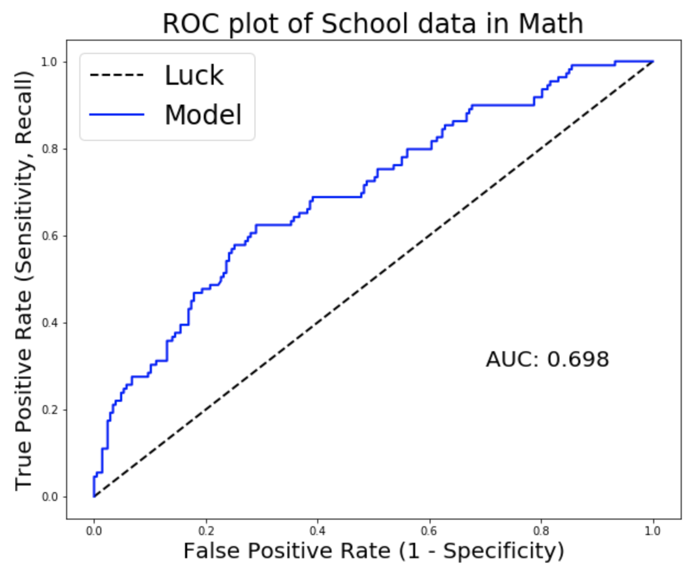
  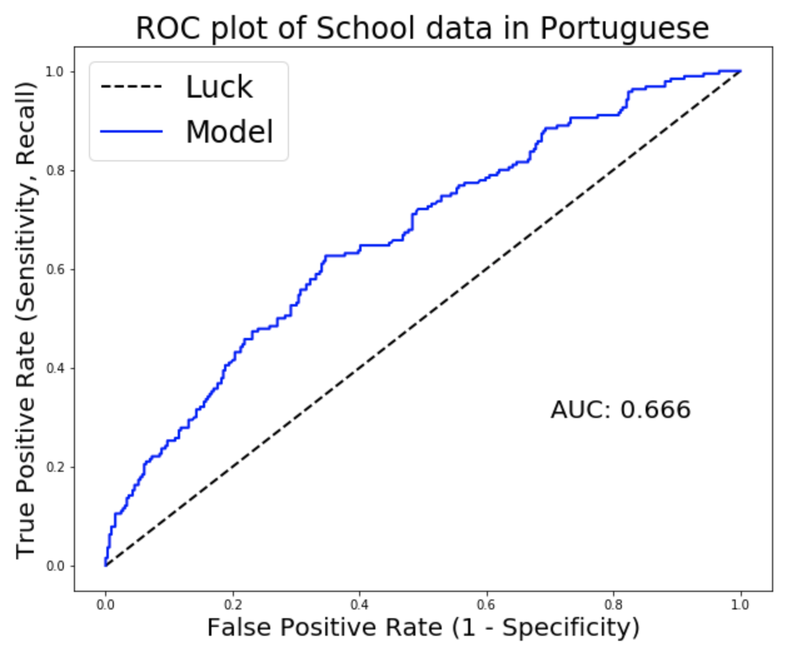

### ROC Curves on Test Data

  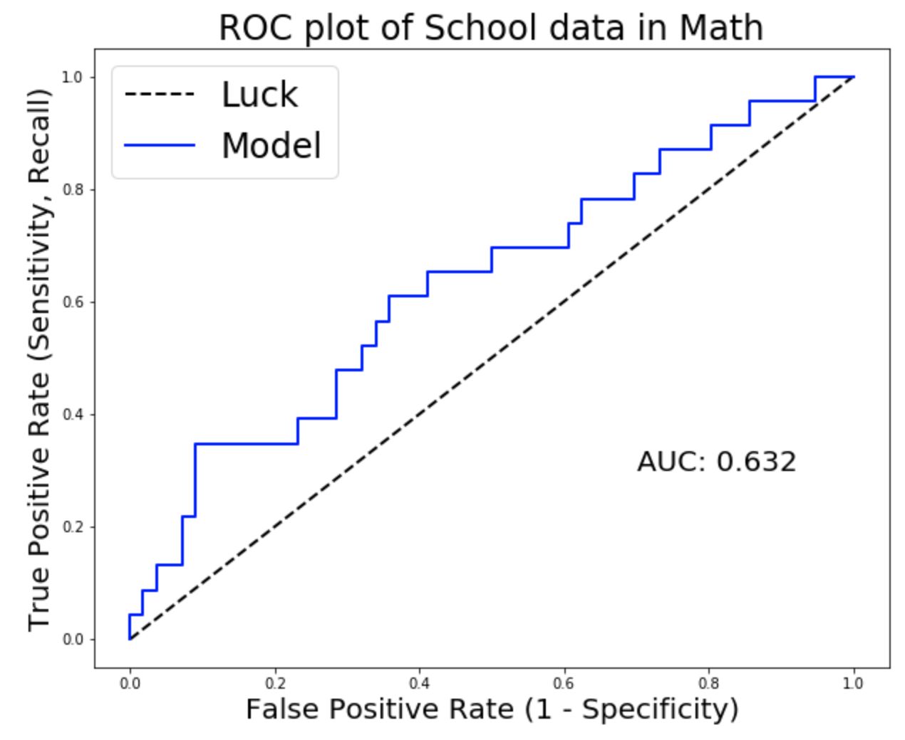
  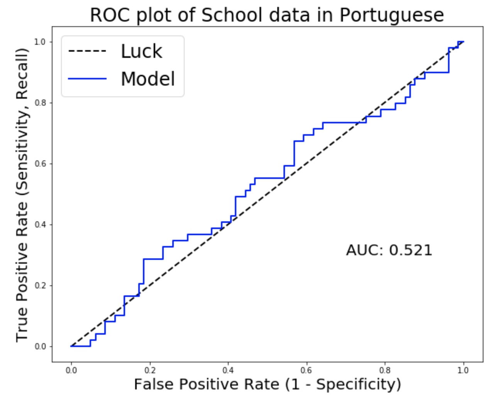

### Math Data Confusion Matrix

  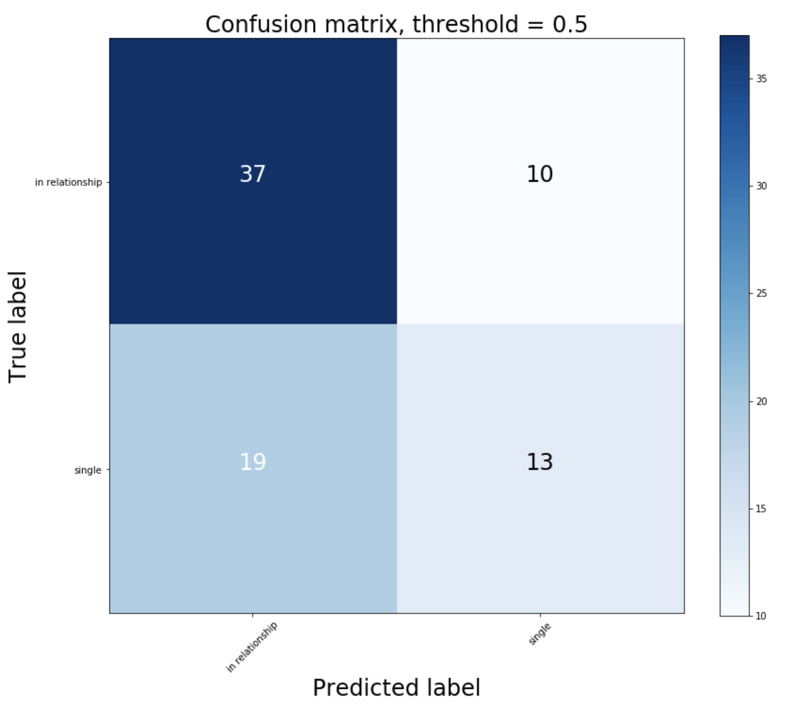

### Portuguese Data Confusion Matrix

  

## Results & Interpretation

Focusing on students in Portuguese courses, the coefficients yielded from our best model were -0.558 for percentage points in the final grade and -0.657 for whether or not a student wanted to pursue higher education. This implies that higher grades do increase the odds that a student is in a relationship, and that a student's desire to pursue higher education increases these odds as well.

### Change in Odds of Being in a Relationship

  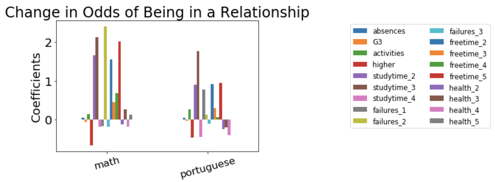

## Significant Coefficients

### Math Dataset

|Feature | Significance Level | Percentage Change in Odds of being in a Relationship|
|--- | --- |--- |
|Had 2 Prior Class Failures| 1% | +240.1%|
|Final Math Grade| 1% | -5.8%|
|Absences| 1% | +3.9%|
|Study >10hrs Weekly| 10% | -18.8%|

### Portuguese Dataset

|Feature | Significance Level | Percentage Change in Odds of being in a Relationship|
|--- | --- |--- |
|Absences| 1% | +4.4%|
|Had 2 Prior Class Failures| 5% | +77.6%|
|Study >10hrs Weekly| 5% | -45.6%|
|Final Portuguese Grade| 5% | -3.8%|
|Study 5-10hrs Weekly| 10% | +176.8%|

# Conclusion

# Acknowledgements
## Citation
P. Cortez and A. Silva. Using Data Mining to Predict Secondary School Student Performance. In A. Brito and J. Teixeira Eds., Proceedings of 5th FUture BUsiness TEChnology Conference (FUBUTEC 2008) pp. 5-12, Porto, Portugal, April, 2008, EUROSIS, ISBN 978-9077381-39-7.
